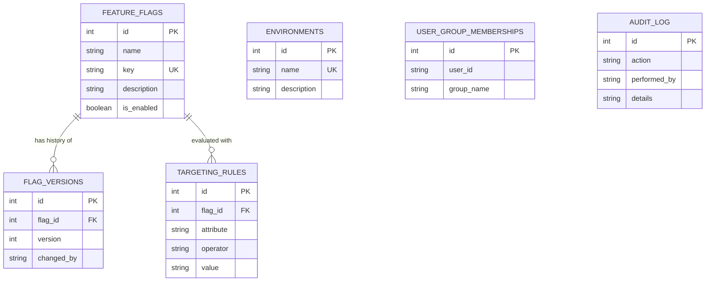

# Feature Flag Management System - Database Schema Documentation

This document describes the relational database schema for the Feature Flag Management System. The system is built on PostgreSQL using SQLAlchemy ORM and managed via Alembic migrations.

---

## Entity Relationship Diagram

---

## Table Details

### 1. `feature_flags`
Stores the core feature flag definitions and their toggle states.

| Column | Type | Constraints | Description |
| :--- | :--- | :--- | :--- |
| `id` | `INTEGER` | `PRIMARY KEY`, `INDEX` | Unique identifier for the flag. |
| `name` | `VARCHAR(100)` | `NOT NULL` | Human-readable name of the feature flag. |
| `key` | `VARCHAR(100)` | `NOT NULL`, `UNIQUE`, `INDEX` | System key used in client/SDK evaluation (e.g., `new_checkout_flow`). |
| `description` | `VARCHAR(255)` | `NULLABLE` | Optional detailed description of what the flag controls. |
| `is_enabled` | `BOOLEAN` | `DEFAULT False` | Global toggle status of the flag. |

---

### 2. `environments`
Defines operational environments (e.g., Development, Staging, Production).

| Column | Type | Constraints | Description |
| :--- | :--- | :--- | :--- |
| `id` | `INTEGER` | `PRIMARY KEY`, `INDEX` | Unique identifier for the environment. |
| `name` | `VARCHAR(50)` | `NOT NULL`, `UNIQUE` | Unique environment name (e.g., `production`). |
| `description` | `VARCHAR(255)` | `NULLABLE` | Optional description of the environment. |

---

### 3. `flag_versions`
Tracks version history and changes for each feature flag.

| Column | Type | Constraints | Description |
| :--- | :--- | :--- | :--- |
| `id` | `INTEGER` | `PRIMARY KEY` | Unique identifier for the version record. |
| `flag_id` | `INTEGER` | `NOT NULL`, `FOREIGN KEY` | References `feature_flags(id)`. |
| `version` | `INTEGER` | `NULLABLE` | Incremental version number for the flag. |
| `changed_by` | `VARCHAR(100)` | `NULLABLE` | User or service account that made the change. |

---

### 4. `targeting_rules`
Defines targeting rules for user segment evaluation (e.g., attribute matching).

| Column | Type | Constraints | Description |
| :--- | :--- | :--- | :--- |
| `id` | `INTEGER` | `PRIMARY KEY` | Unique identifier for the rule. |
| `flag_id` | `INTEGER` | `NOT NULL`, `FOREIGN KEY` | References `feature_flags(id)`. |
| `attribute` | `VARCHAR(100)` | `NULLABLE` | User attribute to evaluate (e.g., `email`, `country`). |
| `operator` | `VARCHAR(50)` | `NULLABLE` | Comparison operator (e.g., `EQUALS`, `CONTAINS`, `IN`). |
| `value` | `VARCHAR(255)` | `NULLABLE` | Target value to match against. |

---

### 5. `user_group_memberships`
Maps users to specific target groups for flag targeting and rollout testing.

| Column | Type | Constraints | Description |
| :--- | :--- | :--- | :--- |
| `id` | `INTEGER` | `PRIMARY KEY` | Unique identifier for the membership record. |
| `user_id` | `VARCHAR(100)` | `NULLABLE` | Identifier of the user. |
| `group_name` | `VARCHAR(100)` | `NULLABLE` | Target group name (e.g., `beta_testers`). |

---

### 6. `audit_log`
Records administrative actions for compliance and tracking.

| Column | Type | Constraints | Description |
| :--- | :--- | :--- | :--- |
| `id` | `INTEGER` | `PRIMARY KEY` | Unique identifier for the audit entry. |
| `action` | `VARCHAR(100)` | `NULLABLE` | Action performed (e.g., `FLAG_CREATED`, `FLAG_TOGGLED`). |
| `performed_by` | `VARCHAR(100)` | `NULLABLE` | User or system process that performed the action. |
| `details` | `VARCHAR(255)` | `NULLABLE` | JSON or textual detail payload describing the event. |
